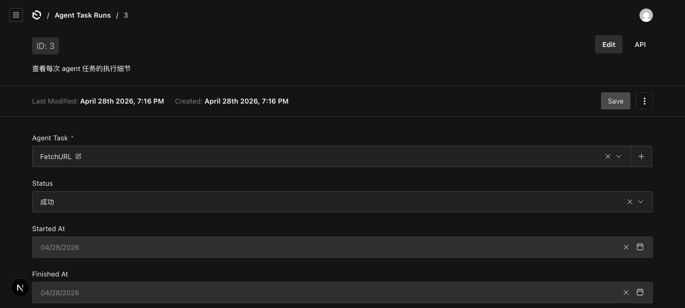

# Agent Task 最佳实践（KB + AI Task 端到端跑通笔记）

> 本文记录把 URL → agent 抓取 → 文件 → KB → 索引 → embedding 整条管线打通后总结的经验，含截图、prompt 模板、踩坑、未来沙箱演进路径。

## TL;DR

- **架构**：admin 触发 → endpoint 入队 `processAgentTaskRun` → 用宿主机 bash 跑 → agent 把结果写到 `runRoot/workspace/output.md` → 最终回复**只**返回该文件绝对路径 → 平台读文件回写 KB → 走 KB 索引管线
- **关键约定**：agent **不返回内容本身**，**返回路径**；这样万一内容很大也不爆 token
- **当前沙箱**：宿主机 bash（无隔离，仅本地用），TODO 标注未来切远程
- **测试结果**：21.7s, 5 steps, 1732 tokens（DeepSeek v4 Pro），完整链路 ✅

## 一次成功运行的执行轨迹

agent-task #1 (FetchURL) + KB#2 (URL=https://example.com) + DeepSeek v4 Pro：

| step | tool | command | exit |
|------|------|---------|------|
| 1 | bash | `mkdir -p ./workspace` | 0 |
| 2 | bash | `curl -L -A "Mozilla/5.0" --max-time 30 "https://example.com" -o ./workspace/page.html` | 0 |
| 3 | bash | `cat ./workspace/page.html \| sed -e "s/<[^>]*>//g" ... > ./workspace/output.md` | 0 |
| 4 | bash | `ls -la ./workspace/output.md && wc -c ./workspace/output.md && pwd` | 0 |
| 5 | (final text) | `/Users/loloru/.../agent-runs/3/workspace/output.md` | — |

最终：output.md 285 字节，KB#2.rawContent 写入 → reindex → chunkCount=1, syncStatus=synced。



## 1. runRoot 目录布局

每次 agent 执行都有独立目录：`apps/platform/.geoflow-data/agent-runs/<runId>/`

```
agent-runs/3/
├── skills/                   # 拷贝过来的整个 skill 文件夹（不仅是 SKILL.md）
│   └── <skill-slug>/
│       ├── SKILL.md
│       └── ... (脚本、资源)
└── workspace/                # agent 的工作目录
    ├── page.html             # 中间产物
    └── output.md             # 最终输出（绑定 KB 时必须写这个）
```

**bash 工具的 cwd = runRoot**（不是 workspace），这样 agent 可以同时访问 `./skills/` 和 `./workspace/`。

> **⚠️ skill 文件夹完整性**：`copyDir` 用 `fs.readdir({withFileTypes:true})` 递归拷贝整个 skill 目录，SKILL.md 旁边的脚本/资源都会一起带过去。不要只复制 SKILL.md。

## 2. Prompt 模板（变量 + 输出协议）

agent-task 表单字段：

- `prompt`（textarea）：用 `{{key}}` 占位
- `variables[].key/defaultValue`：声明变量 + 默认值
- `outputMode`：`text` / `file`，绑定 KB 时强制 `file`
- `enableBash`：必开
- `skills`：可选关联

**模板语法**：`/\{\{\s*([\w.-]+)\s*\}\}/g`，运行时按 `runInputs` 覆盖默认值。

### URL 抓取 prompt 模板（已验证）

```text
你是一个网页抓取助手。当前 cwd 是 runRoot；下面所有命令都用 bash 工具执行。

任务：抓取 URL 并保存为 markdown。变量 url={{url}}

步骤：
1. mkdir -p ./workspace
2. curl -L -A "Mozilla/5.0" --max-time 30 "{{url}}" -o ./workspace/page.html
3. 用 sed/grep/awk 把 HTML 整理成 markdown，写入 ./workspace/output.md
4. ls -la ./workspace/output.md 确认存在，wc -c 检查非空

最终回复**只**返回 ./workspace/output.md 的绝对路径，单行纯文本。
不要返回内容、不要解释、不要 markdown 代码块。
```

### 输出协议（自动注入到 system prompt）

绑定 KB 或 outputMode=file 时，平台会在 system prompt 末尾追加：

```text
——
【输出协议（重要）】
bash 当前工作目录(cwd)是: <runRoot>
请把最终结果（markdown 格式纯文本）写入文件：<runRoot>/workspace/output.md
可以直接用 `cat > ./workspace/output.md << 'EOF' ... EOF` 或 writeFile 工具写入。
完成后，最终回复**只**返回这个绝对路径，单行纯文本，不要返回内容、不要加引号、不要解释、不要 markdown 代码块。
```

### Path 解析的健壮性

`processAgentTaskRun` 解析 `finalOutput` 时：

1. 按行 split → trim → 过滤空行和 ```` ``` ````
2. 取最后一行 → 去掉首尾 `` ` ``、`'`、`"`
3. 相对路径按 `runRoot` 解析为绝对路径
4. 安全校验：必须落在 `process.cwd()/.geoflow-data/` 子树内

这样 agent 即使把路径包在反引号或多写几行解释也能容错。

## 3. 当前沙箱：宿主机 bash（本地开发用）

```ts
// processAgentTaskRun.ts
function createHostBashSandbox(runRoot: string, timeoutMs: number) {
  return {
    async executeCommand(command) {
      return await new Promise((resolve) => {
        exec(command, {
          cwd: runRoot,
          timeout: timeoutMs,
          maxBuffer: 10 * 1024 * 1024,
          shell: '/bin/bash',
          env: { ...process.env },
        }, (err, stdout, stderr) => { ... })
      })
    },
    async readFile(p) { ... },
    async writeFiles(files) { ... },
  }
}
```

实现 `bash-tool` 包的 `Sandbox` 接口，传给 `createBashTool({ sandbox: hostSandbox, destination: runRoot })`。

**为什么不用默认 just-bash**：just-bash 是纯 JS 内存沙箱，**没 curl/wget、没网络、写的文件只在内存**——宿主读不到 output.md，整个链路断掉。

### TODO（远程沙箱）

`processAgentTaskRun.ts` 顶部已加注释，未来：

1. 拆 agent runner 服务（fly.io / vercel sandbox / 自建 Firecracker）
2. 平台 POST `{ prompt, skills(folder tar), variables, model }` 到远程
3. 远程返回 `{ mode: 'text' | 'file', payload }`
4. 平台只需替换 `createHostBashSandbox` 实现成 HTTP 客户端

## 4. KB ↔ Agent 的双链路

KnowledgeBases 文档：

- `sourceType: manual | url | file`
- `fetchAgentTask`：URL 模式下绑定的 agent-task
- `rawContent`：agent 写回的内容
- `syncStatus: pending | indexing | synced | failed`

agent-task-runs 文档（每次执行）：

- `inputs`：本次运行时变量（如 `{url:'https://example.com'}`）
- `linkedKnowledgeBase`：从哪个 KB 触发
- `effectivePrompt`：变量替换后的最终 prompt（**强烈建议落库，便于复盘**）
- `steps[]`：每一步 tool call + result
- `finalOutput`：agent 最后一段文本（绑 KB 时是文件路径）

kb-index-runs（索引生命周期）：

- 状态机：pending → fetching → chunking → embedding → done / failed
- 抓取阶段失败 → cascade 到 agent-task-run.errorMessage + KB.syncStatus

## 5. 截图

| 截图 | 路径 |
|---|---|
| Admin Dashboard | `assets/screenshots/01-admin-dashboard.png` |
| KB 详情 + 两个按钮 | `assets/screenshots/02-kb-detail-with-buttons.png` |
| Agent Run 详情 | `assets/screenshots/03a-run-top.png` ~ `03e-run-steps2.png` |
| KB Index Runs 列表 | `assets/screenshots/04-kb-index-runs-list.png` |
| Agent Task 编辑 | `assets/screenshots/05-agent-task-edit.png` |
| Agent Task Runs 列表 | `assets/screenshots/06-agent-task-runs-list.png` |

## 6. 踩过的坑

| # | 现象 | 根因 | 修复 |
|---|------|------|------|
| 1 | `bash: curl: command not found` | just-bash 内存沙箱没系统命令 | 换宿主机 bash |
| 2 | `output.md 不存在` | just-bash 文件只在内存，宿主读不到 | 同上 |
| 3 | `agent 返回的路径不在允许目录内：apps/platform` | agent 返回了 cwd（相对路径），`path.resolve('')` 取 cwd | path 解析改为按 `runRoot` 解析 + 取最后一行 + 去引号 |
| 4 | `validation: invalid relationships: "1 0"` | Payload v3 关系字段不接受字符串数字 | 所有 endpoint/job 入口 `Number.isFinite(Number(id)) ? Number(id) : id` |
| 5 | `Module not found: '@payloadcms/ui'` | 插件 admin component 缺 devDep | plugin package.json 加 devDeps |
| 6 | `no such column: total_chunks` | 列名实际是 `chunk_count` | 改 SQL/where 字段名 |

## 7. 模型配置（已验证可用）

| ai-model | provider | baseUrl | modelId | 用途 |
|---|---|---|---|---|
| 1 local-embedding | local | — | bge-local | embedding |
| 2 mock-chat | local | — | mock | 烟雾测试（永远报错连接） |
| 3 deepseek-v4-pro | openai | https://api.deepseek.com | deepseek-chat | 真实 chat ✅ |

`buildLanguageModel` 把 provider=`openai|openai-compatible|zhipu|bytedance|deepseek` 都路由到 `createOpenAICompatible(name, apiKey, baseURL)`，DeepSeek 走 OpenAI 兼容接口完全 OK。

## 8. 后续改进项

- [ ] 抓取后做更聪明的 HTML→markdown（用 turndown 或者 readability，而不是 sed 粗暴去标签）
- [ ] agent 执行超时 / 步数超限的 graceful 处理
- [ ] 把 `effectivePrompt` 在 admin UI 里高亮展示（目前是 readonly textarea）
- [ ] 远程 sandbox runner（见上文 TODO）
- [ ] skill 库的可视化 + 一键导入
