# GEOFlow 用户操作手册

> 本手册基于实际 admin 界面截图撰写，截图存放于同级 `screenshots/` 目录。

---

## 总览 — 控制台首页

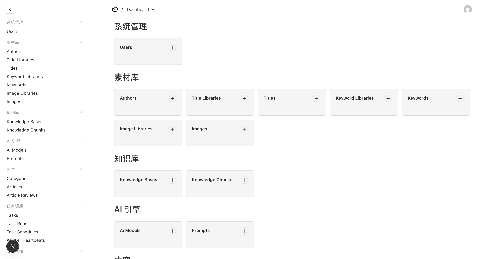
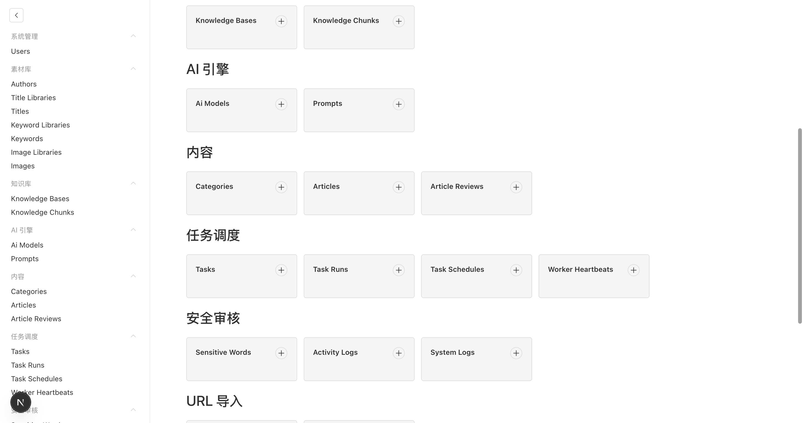
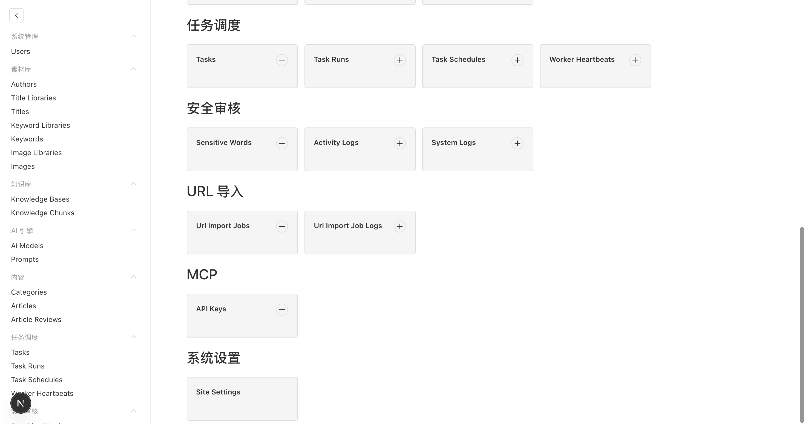

GEOFlow 是一个 **AI 驱动的内容生产平台**，左侧导航和首页 Dashboard 按功能分成 **10 个模块**：

| 分组 | 功能 | 核心 Collection |
|---|---|---|
| 系统管理 | 账号与权限 | Users |
| 素材库 | 创作素材管理 | Authors / Title Libraries / Titles / Keyword Libraries / Keywords / Image Libraries / Images |
| 知识库 | AI 背景知识 | Knowledge Bases / Knowledge Chunks |
| AI 引擎 | 模型与提示词 | Ai Models / Prompts |
| 内容 | 文章生产 | Categories / Articles / Article Reviews |
| 任务调度 | 自动化生产 | Tasks / Task Runs / Task Schedules / Worker Heartbeats |
| 安全审核 | 合规过滤 | Sensitive Words / Activity Logs / System Logs |
| URL 导入 | 外部内容接入 | Url Import Jobs / Url Import Job Logs |
| MCP | API 接入管理 | API Keys |
| 系统设置 | 站点信息 | Site Settings |

---

## 推荐初始化顺序

```
系统设置 → AI 模型 → 提示词 → 素材库 → 知识库 → 任务 → 定时调度
```

---

## 第一步：系统设置

**路径**：左侧导航底部 → **Site Settings**

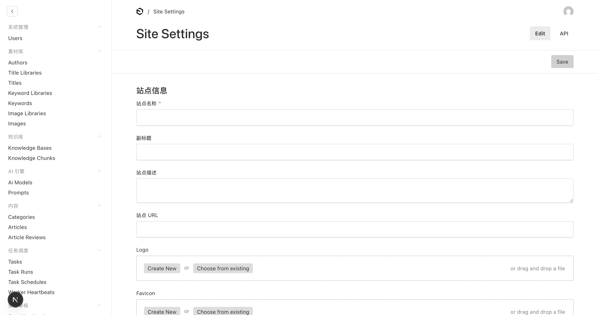

这是全局唯一的 Global 记录，点 **Edit** 编辑后 **Save**。

| 字段 | 说明 |
|---|---|
| 站点名称 | 显示在 admin 顶部标题 |
| 副标题 | 副标题 |
| 站点描述 | SEO 描述 |
| 站点 URL | 生产域名 |
| Logo | 上传 Logo 图片 |
| Favicon | 上传 favicon |

---

## 第二步：配置 AI 模型

**路径**：**AI 引擎 → Ai Models**

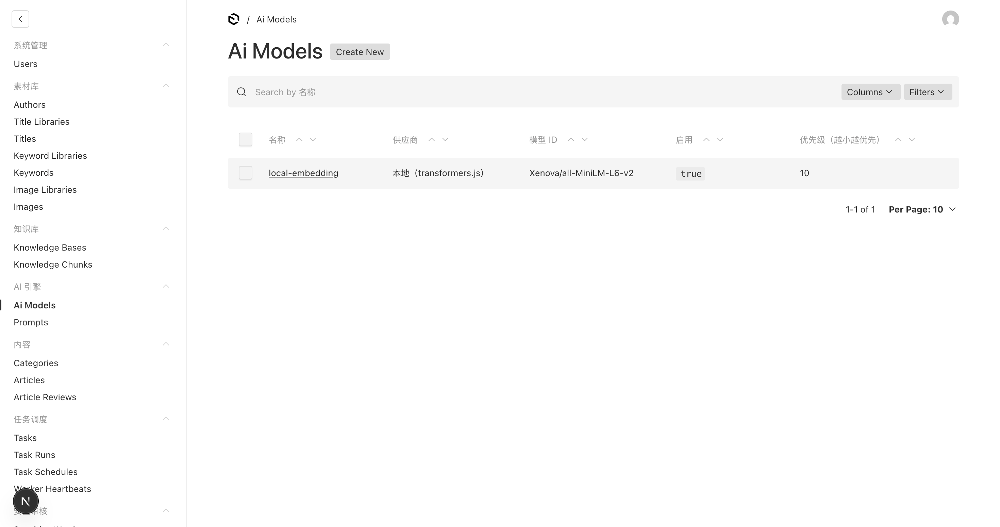

**Create New：**

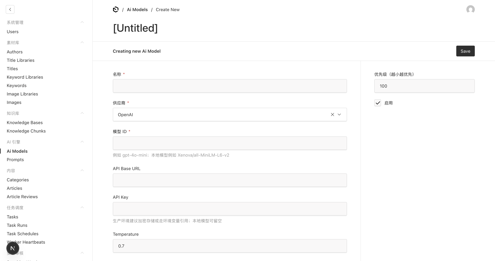

| 字段 | 说明 |
|---|---|
| 名称 | 模型别名，自定义即可 |
| 供应商 | 选 OpenAI / Anthropic / 本地等 |
| 模型 ID | 如 `gpt-4o-mini`、`claude-3-5-sonnet-20241022` |
| API Base URL | 自定义 API 地址（代理/本地部署时填写，官方留空） |
| API Key | 密钥；生产环境建议通过环境变量注入 |
| Temperature | 生成随机性，默认 0.7 |
| 优先级 | 数字越小越优先，多模型时自动选优先级最高的可用模型 |
| 启用 | 关闭则跳过此模型 |

---

## 第三步：创建提示词

**路径**：**AI 引擎 → Prompts**


**Create New：**

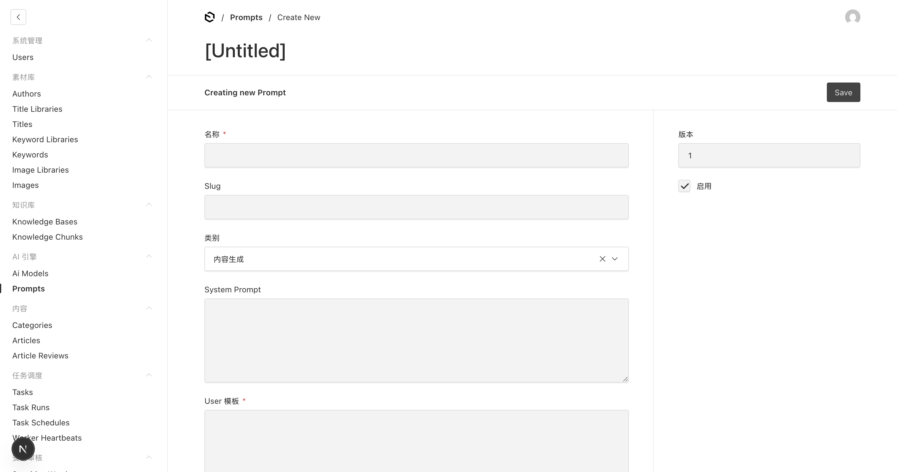

| 字段 | 说明 |
|---|---|
| 名称 | 提示词名称 |
| Slug | 唯一标识符（可自动生成） |
| 类别 | 内容生成 / 标题生成 / 摘要 / 其他 |
| System Prompt | 系统角色设定，可用 `{{keyword}}`、`{{title}}` 等变量 |
| User 模板 | 用户消息模板 |
| 版本 | 自动累加，便于回溯 |
| 启用 | 控制此提示词是否生效 |

---

## 第四步：搭建素材库

素材库是内容生产的原材料，Tasks 执行时会自动从中取标题、关键词、图片。

### 4-1 作者 (Authors)

**路径**：**素材库 → Authors**

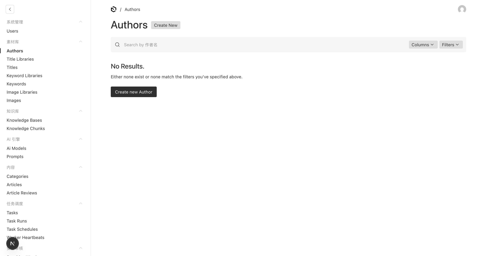

**Create New：**

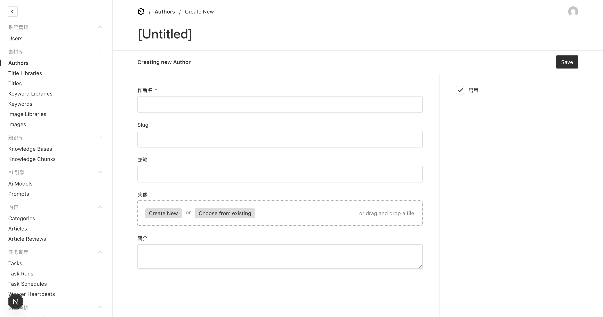

| 字段 | 说明 |
|---|---|
| 作者名 | 必填 |
| Slug | 唯一标识 |
| 邮箱 | 可选 |
| 头像 | 上传或从图库选择 |
| 简介 | 作者简介 |
| 启用 | 关闭后文章不会关联到此作者 |

---

### 4-2 标题库 (Title Libraries) + 标题 (Titles)

两级结构：**先建库，再往库里填标题**。

**步骤 A**：**素材库 → Title Libraries**


点 **Create New** 填写库名（如"科技类标题库"）后保存。

**步骤 B**：**素材库 → Titles**

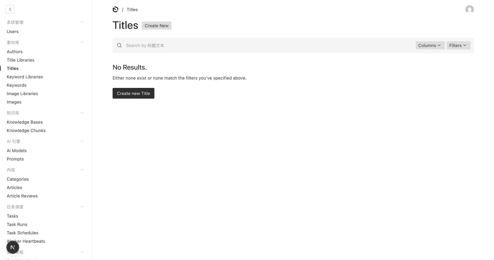

**Create New：**

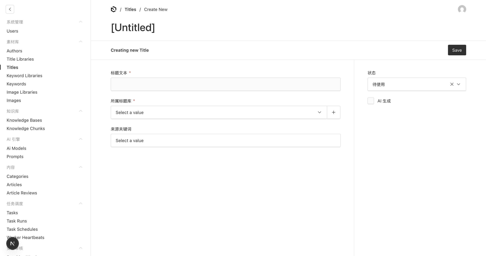

| 字段 | 说明 |
|---|---|
| 标题文本 | 必填，文章候选标题 |
| 所属标题库 | 必填，关联到步骤 A 的库 |
| 来源关键词 | 可选，追踪从哪个关键词生成 |
| 状态 | 待使用 / 已使用 / 已废弃 |
| AI 生成 | 标记是否由 AI 生成 |

> **技巧**：Task 运行时会自动抓取状态为「待使用」的标题，用完后自动标记为「已使用」。

---

### 4-3 关键词库 + 关键词

与标题库同理，两级结构。

- **素材库 → Keyword Libraries** — 先建库
- **素材库 → Keywords** — 再逐条录入关键词

关键词会注入 Prompt，影响 AI 生成内容的 SEO 关键词分布。

---

### 4-4 图片库 + 图片

- **素材库 → Image Libraries** — 先建库
- **素材库 → Images** — 上传图片并关联到库

Task 会从关联的图片库中为文章匹配封面图和内容配图。

---

## 第五步：配置知识库

知识库为 AI 提供领域背景知识，支持 RAG（检索增强生成）。

**路径**：**知识库 → Knowledge Bases**

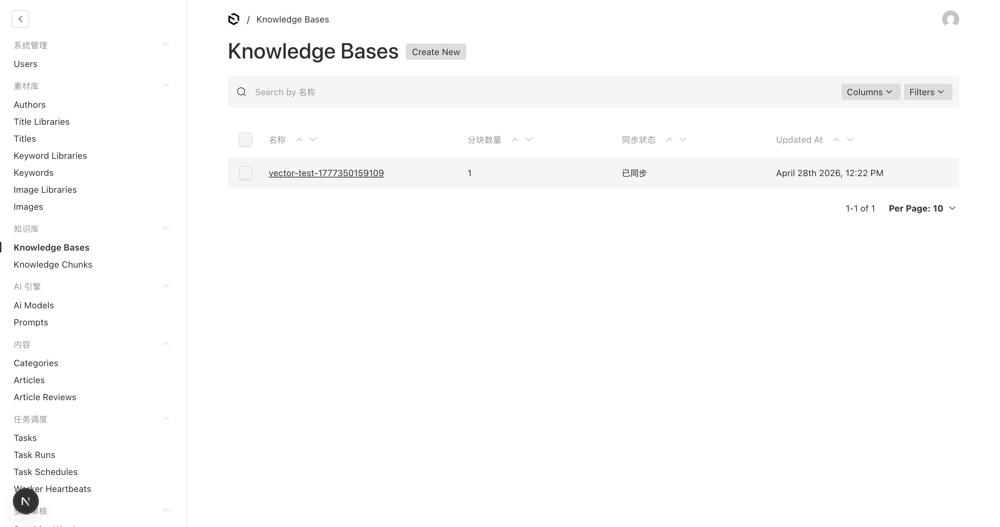

**Create New：**

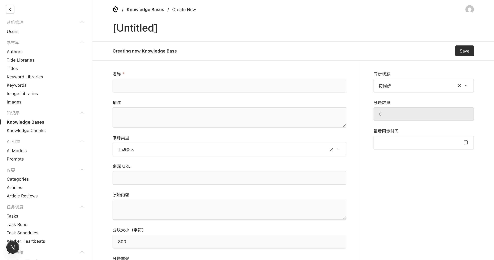

| 字段 | 说明 |
|---|---|
| 名称 | 必填 |
| 描述 | 知识库用途说明 |
| 来源类型 | **手动录入** / URL 导入 / 文件上传 |
| 来源 URL | 若选 URL 来源，填写待抓取页面地址 |
| 原始内容 | 手动粘贴原始文档 |
| 分块大小（字符） | 默认 800，RAG 检索的单个片段大小 |
| 分块重叠 | 相邻分块的重叠字符数，提升检索连续性 |
| 同步状态 | 待同步 / 同步中 / 已同步 |
| 分块数量 | 系统自动统计，只读 |

保存后系统会自动切分内容，生成 **Knowledge Chunks**（可在 **知识库 → Knowledge Chunks** 查看详情）。

---

## 第六步：创建并运行生产任务

Task 是系统的**核心调度单元**，把素材库 + 知识库 + AI 引擎串联起来批量生产文章。

### 6-1 创建任务 (Tasks)

**路径**：**任务调度 → Tasks**

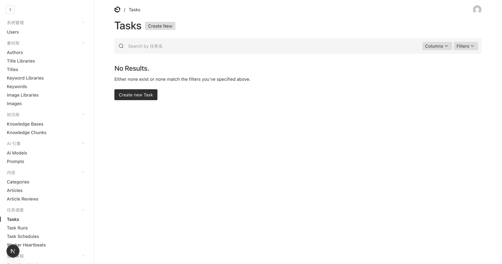

**Create New：**

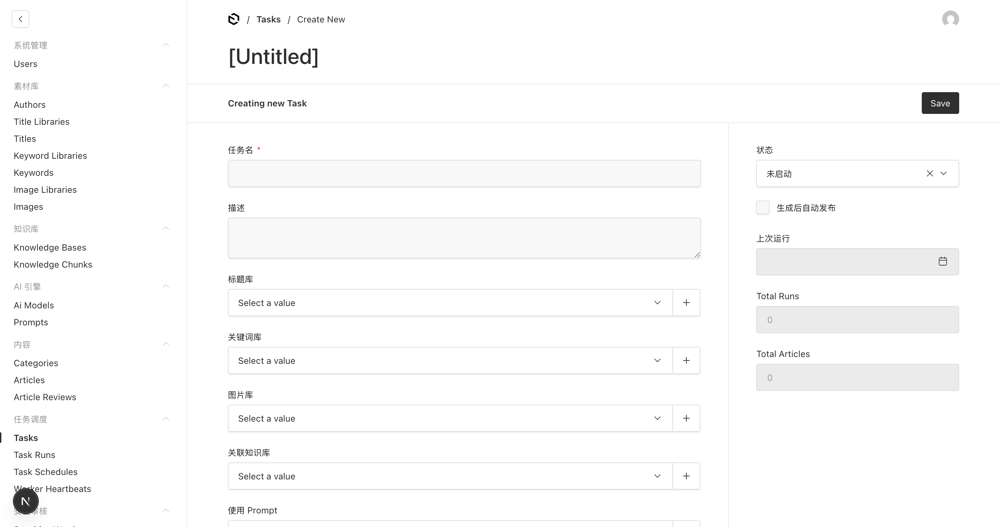

| 字段 | 说明 |
|---|---|
| 任务名 | 必填 |
| 描述 | 说明此任务的生产目标 |
| 标题库 | 关联标题库，每次运行取一条「待使用」标题 |
| 关键词库 | 关联关键词库，提取关键词注入 Prompt |
| 图片库 | 关联图片库，为文章匹配封面图 |
| 关联知识库 | 关联知识库，为 AI 提供 RAG 背景 |
| 使用 Prompt | 选择生成文章用的提示词 |
| 生成后自动发布 | 勾选后文章生成即直接发布，不进审核队列 |
| 状态 | 未启动 / 运行中 / 已完成 |
| 上次运行 / Total Runs / Total Articles | 只读统计数据 |

---

### 6-2 定时调度 (Task Schedules)

**路径**：**任务调度 → Task Schedules**

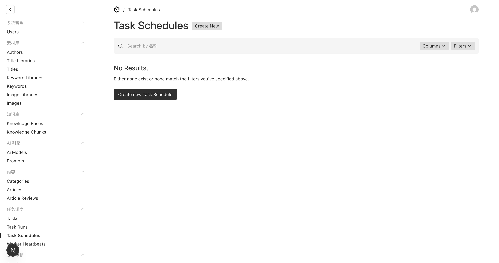

**Create New：**

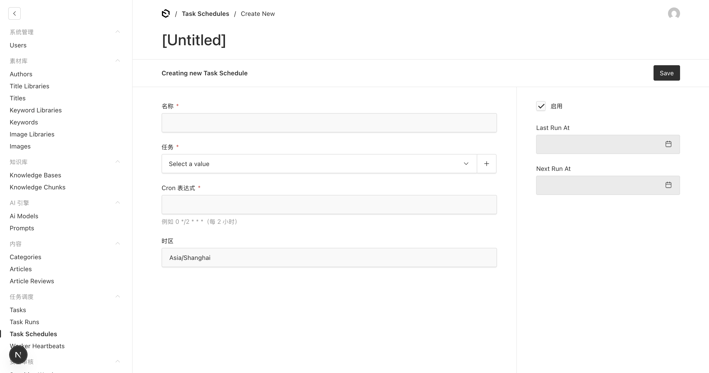

给 Task 配上 Cron 表达式，实现**全自动定时生产**。

| 字段 | 说明 | 示例 |
|---|---|---|
| 名称 | 调度名称 | 科技文章每日生产 |
| 任务 | 关联到已创建的 Task | — |
| Cron 表达式 | 标准 Cron 语法 | `0 9 * * *`（每天 9 点） |
| 时区 | 默认 Asia/Shanghai | — |
| 启用 | 关闭后暂停此调度 | — |
| Last Run At / Next Run At | 只读，系统自动更新 | — |

**Cron 速查：**

| 表达式 | 含义 |
|---|---|
| `0 * * * *` | 每小时整点 |
| `0 */2 * * *` | 每 2 小时 |
| `0 9 * * 1-5` | 工作日 9:00 |
| `*/30 * * * *` | 每 30 分钟 |

---

### 6-3 查看运行记录 (Task Runs)

**路径**：**任务调度 → Task Runs**

每次 Task 执行都会创建一条 Task Run 记录，可查看：
- 开始 / 结束时间
- 生成文章数量
- 失败原因（如模型 API 报错、无可用标题等）

---

### 6-4 Worker 心跳 (Worker Heartbeats)

**路径**：**任务调度 → Worker Heartbeats**

显示后台 Worker 进程的存活状态。如果长时间没有心跳记录，说明 Worker 进程已停止，需要重启。

---

## 第七步：内容管理

### 7-1 分类 (Categories)

**路径**：**内容 → Categories**

创建文章分类，供文章归类和前端筛选。

---

### 7-2 文章 (Articles)

**路径**：**内容 → Articles**

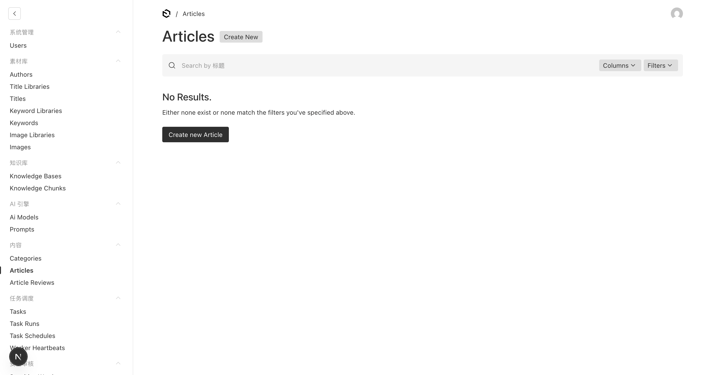

**Create New（或查看 AI 自动生成的文章）：**

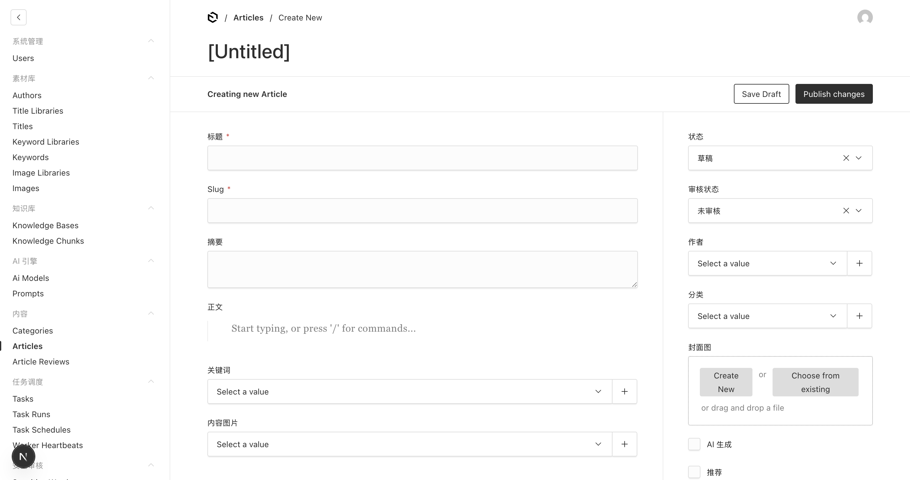

| 字段 | 说明 |
|---|---|
| 标题 | 必填 |
| Slug | URL 路径，自动生成可手动改 |
| 摘要 | 文章摘要 |
| 正文 | 富文本编辑器（Lexical），支持 `/` 命令插入组件 |
| 关键词 | 关联关键词 |
| 封面图 | 文章封面 |
| 作者 | 关联作者 |
| 分类 | 关联分类 |
| 状态 | 草稿 / 已发布 |
| 审核状态 | 未审核 / 审核中 / 已通过 / 已拒绝 |
| AI 生成 | 标记是否 AI 生成 |
| 推荐 | 标记为首页推荐文章 |

操作按钮：
- **Save Draft** — 保存为草稿
- **Publish changes** — 直接发布

---

### 7-3 文章审核 (Article Reviews)

**路径**：**内容 → Article Reviews**

当 Task 的「生成后自动发布」未勾选时，AI 生成的文章会进入此队列。

- **通过** → 文章状态变为已发布
- **拒绝** → 退回或标记废弃

---

## 第八步：URL 导入

**路径**：**URL 导入 → Url Import Jobs**


**Create New：**

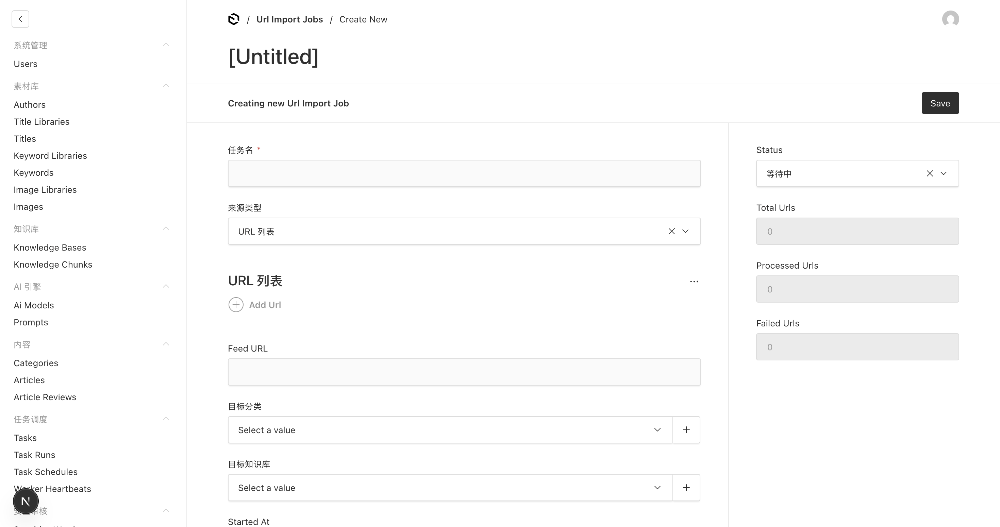

从外部网页或 RSS Feed 批量抓取内容，自动写入知识库或直接生成文章。

| 字段 | 说明 |
|---|---|
| 任务名 | 必填 |
| 来源类型 | **URL 列表**（手动添多条 URL）/ Feed URL（RSS/Atom） |
| URL 列表 | 逐条添加要抓取的页面 URL |
| Feed URL | RSS/Atom 订阅地址 |
| 目标分类 | 抓取内容归入哪个文章分类 |
| 目标知识库 | 抓取内容同步到哪个知识库 |
| Status | 等待中 / 运行中 / 已完成 |
| Total / Processed / Failed Urls | 只读进度统计 |

执行日志在 **Url Import Job Logs** 查看。

---

## 第九步：安全审核

### 敏感词 (Sensitive Words)

**路径**：**安全审核 → Sensitive Words**


维护敏感词列表，文章发布前自动过滤，添加后即时生效。

### 操作日志 (Activity Logs)

**路径**：**安全审核 → Activity Logs**

记录所有用户操作（谁、什么时间、对哪条数据做了什么），用于合规审计，只读。

### 系统日志 (System Logs)

**路径**：**安全审核 → System Logs**

记录系统级错误和警告（如模型调用失败、Worker 异常），排查问题时首先查看这里。

---

## 第十步：MCP API 接入

**路径**：**MCP → API Keys**

为外部工具（如 Claude Desktop、Cursor、自定义脚本）生成 API Key，通过 **MCP 协议**直接访问平台数据。

**典型场景：**
- 在 Claude Desktop 中通过 MCP 查询 / 创建文章
- 在 AI Agent 中调用平台 API 创建任务

---

## 完整操作流程图

```
系统设置
    ↓
配置 AI 模型 (Ai Models)
    ↓
创建提示词 (Prompts)
    ↓
搭建素材库 ──────────────────────────── 搭建知识库
 Authors                                Knowledge Bases
 Title Libraries → Titles               Knowledge Chunks
 Keyword Libraries → Keywords
 Image Libraries → Images
    ↓                                        ↓
              创建任务 (Tasks)
         [标题库 + 关键词库 + 图片库 + 知识库 + Prompt]
                    ↓
         配置定时调度 (Task Schedules)
                    ↓
         后台自动执行 → Task Runs
                    ↓
              文章生成 (Articles)
                    ↓
         ┌──────────────────────────┐
    自动发布                   进入审核队列
   (直接上线)            Article Reviews → 通过 → 发布
```

---

## 常见操作速查

| 我想做的事 | 路径 |
|---|---|
| 添加新的 AI 模型（如 GPT-4o） | AI 引擎 → Ai Models → Create New |
| 批量录入标题供 AI 写作 | 素材库 → Titles → Create New |
| 让系统每天定时自动写文章 | 任务调度 → Tasks 建任务 → Task Schedules 配置定时 |
| 查看 AI 今天写了哪些文章 | 内容 → Articles，筛选今日 |
| 审核 AI 生成的文章 | 内容 → Article Reviews |
| 从一批 URL 抓取内容进知识库 | URL 导入 → Url Import Jobs |
| 查看 Worker 是否在运行 | 任务调度 → Worker Heartbeats |
| 排查生产失败原因 | 任务调度 → Task Runs / 安全审核 → System Logs |
| 给 Claude Desktop 接入平台 | MCP → API Keys |
| 过滤违规词汇 | 安全审核 → Sensitive Words |
